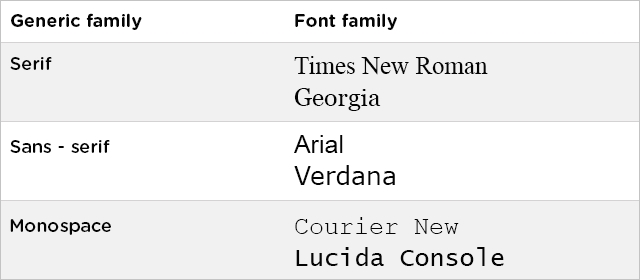

# Basics Overview

**CSS** stands for **Cascading Style Sheets:**

* **Cascading** refers to the way CSS applies one style on top of another.
* **Style Sheets** control the look and feel of web documents.

  CSS and HTML work hand in hand:

* HTML sorts out the page structure.
* CSS defines how HTML elements are displayed.

  The main benefit of **CSS** is that it allows you to **separate style from content**. Using just HTML, all the styles and formatting are in the same place, which becomes rather difficult to maintain as the page grows. All formatting can \(and should\) be removed from the HTML document and stored in a separate CSS file.

## **Usage: Inline, Embedded, External CSS**

### **Inline CSS**

Using an inline style is one of the ways to insert a style sheet. With an inline style, a unique style is applied to a single element.

In order to use an inline style, add the **style** attribute to the relevant tag.

The example below shows how to create a paragraph with a grey background and white text:

```markup
  <p style="color:white; background-color:gray;">
      This is an example of inline styling. 
  </p>
```

The style attribute can contain any CSS property.

### **Embedded/Internal CSS**

Internal styles are defined within the `<style>` element, inside the **head section of an HTML page**.

For example, the following code styles all paragraphs:

```markup
  <html>
     <head>
        <style>
        p {
           color:white;
           background-color:gray;
        }
        </style>
     </head>
     <body>
        <p>This is my first paragraph. </p>
        <p>This is my second paragraph. </p>
     </body>
  </html>
```

An internal style sheet may be used if one single page has a unique style.

### **External CSS**

With this method, all styling rules are contained in a single text file, which is saved with the .css extension. This CSS file is then referenced in the HTML using the `<link>` tag. The `<link>` element goes **inside the head section**.

Here is an example:

The HTML:

```markup
  <head>
     <link rel="stylesheet" href="example.css">
  </head>
  <body>
     <p>This is my first paragraph.</p>
     <p>This is my second paragraph. </p>
     <p>This is my third paragraph. </p>
  </body>
```

The CSS:

```css
  p {
     color:white;
     background-color:gray;
  }
```

Both relative and absolute paths can be used to define the `href` for the CSS file. In our example, the path is relative, as the CSS file is in the same directory as the HTML file.

## Rules and Selectors 选择器

CSS is composed of style rules that the browser interprets and then applies to the corresponding elements in your document.

A style rule has three parts: **selector**, **property**, and **value**.

[https://api.sololearn.com/DownloadFile?id=2584](https://api.sololearn.com/DownloadFile?id=2584)

The selector points to the HTML element you want to style.

The declaration block contains one or more declarations, separated by semicolons. Each declaration includes a property name and a value, separated by a colon.

The most common and easy to understand selectors are type selectors. This selector targets element types on the page.

```css
  p {
     color: red;
     font-size:130%;
  }
```

A CSS declaration always ends with a semicolon, and declaration groups are surrounded by curly braces.

### **ID Selectors**

**id selectors** allow you to **style an HTML element** that has an id attribute, **regardless of their position in the document tree**. Here is an example of an id selector:

```markup
  <div id="intro">
     <p> This paragraph is in the intro section.</p>
  </div>
  <p> This paragraph is not in the intro section.</p>
```

```css
  #intro {
     color: white;
     background-color: gray;
  }
```

To select an element with a specific id, **use a hash character**, and then follow it with the id of the element.

### **Class Selectors**

**Class selectors** work in a similar way. The major difference is that **IDs can only be applied once per page**, while **classes can be used as many times** on a page as needed.

```markup
  <div>
     <p class="first">This is a paragraph</p>
     <p> This is the second paragraph. </p>
  </div>
  <p class="first"> This is not in the intro section</p>
  <p> The second paragraph is not in the intro section. </p>
```

```css
  .first {font-size: 200%;}
```

To select elements with a specific class, **use a period character**, followed by the name of the class. Do NOT start a class or id name with a number!

### **Descendant Selectors**

These selectors are used to select elements that are descendants of another element. When selecting levels, you can select as many levels deep as you need to.

For example, to target only elements in the first paragraph of the "intro" section:

```markup
  <div id="intro">
     <p class="first">This is a <em> paragraph.</em></p>
     <p> This is the second paragraph. </p>
  </div>
  <p class="first"> This is not in the intro section.</p>
  <p> The second paragraph is not in the intro section. </p>
```

```css
  #intro .first em {
     color: pink; 
     background-color:gray;
  }
```

### **选择器的权重 CSS selector specificity**

* 第一等：代表**内联样式**，如: **style="xxx"**，权值为**1000**。
* 第二等：代表**ID选择器**，如：\#content，权值为**100**。
* 第三等：代表**class类，伪类和属性选择器**，如.content，:hover，\[attribute\]，权值为**10**。
* 第四等：代表**tag元素选择器**和伪元素选择器，如div，p，权值为**1**。
* 第五等：注意：通用选择器（\*），子选择器（&gt;）和相邻同胞选择器（+）并不在这四个等级中，所以他们的权值都为0。
* 第六等：继承的样式没有权值。

  \*\*\*\*

#### **元素选择器和伪元素选择器**

使用较多，但不可以差异化；权重：1

```css
p {
      color: red;
}
```

#### **类、伪类和属性选择器**

非常常用，可以根据需求选择；权重：10

```css
.grey-background {
  background-color: grey;
}
```

#### **ID 选择器**

相当于身份证，一人一码，原则上不可重复；权重：100

```css
.red {
  color: pink;
}
```

#### **通配符选择器**

一次性选择页面里所有的标签；选择的太多，有部分可能不需要；权重：0

```css
* {
  color: green;
}
```

## **Comments**

Comments are used to explain your code, and may help you when you edit the source code later. Comments are ignored by browsers.

```css
  p { 
    color: green; 
    /* This is a comment */
    font-size: 150%;
  }
```

Comments can also span multiple lines.

## **Inheritance**

Inheritance refers to the way properties flow through the page. A child element will usually take on the characteristics of the parent element unless otherwise defined.

```markup
  <html>
     <head>
        <style>
        body {
           color: green;
           font-family: Arial;
        }
       </style>
     </head>
     <body>       
        <p>
        This is a text inside the paragraph. 
        </p>
     </body>
  </html>
```

Since the paragraph tag \(child element\) is inside the body tag \(parent element\), it takes on any styles assigned to the body tag.

### **font-family**

**The font-family Property**

The font-family property specifies the font for an element. There are two types of font family names:

* **font-family**: a specific font family \(like Times New Roman or Arial\)
* **generic family**: a group of font families with a similar look \(like Serif or Monospace\)



```markup
<p class="serif">
 This is a paragraph shown in serif font.
</p>
<p class="sansserif">
 This is a paragraph shown in sans-serif font.
</p> 
<p class="monospace">
 This is a paragraph shown in monospace font.
</p> 
<p class="cursive">
 This is a paragraph shown in cursive font.
</p> 
<p class="fantasy">
 This is a paragraph shown in fantasy font.
</p>
```

```css
p.serif {
 font-family: "Times New Roman", Times, serif;
}
p.sansserif {
 font-family: Helvetica, Arial, sans-serif;
}
p.monospace {
 font-family: "Courier New", Courier, monospace;
}
p.cursive {
 font-family: Florence, cursive;
}
p.fantasy {
 font-family: Blippo, fantasy;
}
```


Separate each value with a comma to indicate that they are alternatives. If the name of a font family is **more than one word, it must be in quotation marks**: "Times New Roman".

The font-family property should **hold several font names** as a "fallback" system. When specifying a web font in a CSS style, add more than one font name, in order to avoid unexpected behaviors. If the client computer for some reason doesn't have the one you choose, it will try the next one.

### **font-size**

The **font-size property** sets the size of a font. One way to set the size of fonts on the web is to use keywords. For example **xx-small**, **small**, **medium**, **large**, **larger**, etc.

```markup
  <p class="small">
     Paragraph text set to be small
  </p>
  <p class="medium">
     Paragraph text set to be medium
  </p>
  <p class="large">
     Paragraph text set to be large
  </p>
  <p class="xlarge">
     Paragraph text set to be very large
  </p>
```

```css
  p.small {
     font-size: small;
  }
  p.medium {
     font-size: medium;
  }
  p.large {
     font-size: large;
  }
  p.xlarge {
     font-size: x-large;
  }
```

[https://api.sololearn.com/DownloadFile?id=2590](https://api.sololearn.com/DownloadFile?id=2590)

Keywords are useful if you do not want the user to be able to increase the size of the font because it will adversely affect your site's appearance.

You can also use numerical values in **pixels** or **ems** to manipulate font size.

Setting the font size in pixel values \(px\) is a good choice when you need pixel accuracy, and it gives you full control over the text size.

The em size unit is another way to set the font size \(em is a relative size unit\). It allows all major browsers to resize the text. If you haven't set the font size anywhere on the page, then it is the **browser's default size**, which **is 16px**.（chrome浏览器）

To calculate the em size, just use the following formula: **em = pixels / 16**

```css
  h1 {
     font-size: 20px;
  }
  /*The same value in em would be...*/
  h1 {
     font-size: 1.25em;
  }
```

Try different combinations of text size and page zooming in a variety of browsers to ensure that the text remains readable.

### **font-style**

The font-style property is typically used to specify italic text.

```css
  p.italic {
     font-style: italic;
  }
```

The font-style property has three values: **normal**, **italic**, and **oblique**. Oblique is very similar to italic, but less supported.

The HTML `<i>` tag will produce exactly the same result as the italic font style.

### **font-weight**

The font-weight controls the boldness or thickness of the text. The values can be set as **normal** \(default size\), **bold**, **bolder**, and **lighter**.

```css
  p.light {   
     font-weight: lighter;
  }
  p.bold {   
     font-weight: bold;
  }
  p.bolder {
     font-weight: bolder;
  }
```

[https://api.sololearn.com/DownloadFile?id=2592](https://api.sololearn.com/DownloadFile?id=2592)

You can also define the font weight with a number from **100 \(thin\)** to **900 \(thick\)**, according to how thick you want the text to be. **400 is the same as normal**, and **700 is the same as bold**.无需加单位

The HTML `<strong>` tag also makes the text bold.

### **font-variant**

The CSS font-variant property allows you to convert your font to all small caps. The values can be set as **normal**, **small-caps**, and **inherit**.

```css
  p.normal {
     font-variant: normal;
  }
  p.small {
     font-variant: small-caps;
  }
```

[https://api.sololearn.com/DownloadFile?id=2594](https://api.sololearn.com/DownloadFile?id=2594)

### **Text Color**

The CSS **color** property specifies the color of the text.

One method of specifying the color of the text is using a **color name**: red, green, blue, etc.

Another way of defining colors is using **hexadecimal** values **and RGB**.

```css
  h1 {
     color: #0000FF;
  }
  p.example {
     color: rgb(255,0,0);
  }
```

### **text-align**

The **text-align** property specifies the **horizontal alignment** of text in an element. By default, text on your website is aligned to the left. However, at times you may require a different alignment.

text-align property values are as follows: **left**, **right**, **center**, and **justify**.

```css

```

### **vertical-align**

The **vertical-align** property sets an element's vertical alignment. Commonly used values are **top**, **middle**, and **bottom**.

```markup
  <table border="1" cellpadding="2" cellspacing="0" style="height: 150px;">
    <tr>
       <td class="top">Top</td>
       <td class="middle">Middle</td>
       <td class="bottom">Bottom</td>
    </tr>
  </table>
```

```css
  td.top {
     vertical-align: top;
  }
  td.middle {
     vertical-align: middle;
  }
  td.bottom {
     vertical-align: bottom;
  }
```

[https://api.sololearn.com/DownloadFile?id=3016](https://api.sololearn.com/DownloadFile?id=3016)

The vertical-align property also takes the following values: **baseline**, **sub**, **super**, **%** and **px** \(or pt, cm\).

```markup
  <p>This is an <span class="baseline">inline text</span> example.</p>
  <p>This is a <span class="sub">sub line text</span> example.</p>
  <p> This is a <span class="super">super line text</span> example.</p>
  <p> This is a <span class="pixel">pixel</span> example.</p>
```

```css
  span.baseline {
      vertical-align: baseline;
  }
  span.sub {
      vertical-align: sub;
  }
  span.super {
      vertical-align: super;
  }
  span.pixel {
      vertical-align: -10px;
  }
```

[https://api.sololearn.com/DownloadFile?id=2599](https://api.sololearn.com/DownloadFile?id=2599)

Vertical align property does not act the same way for all elements. For example, some additional CSS styling is needed for div elements.

```markup
  <div class="main">
     <div class="paragraph">
     This text is aligned to the middle
     </div>
  </div>
```

```css
  .main {
      height: 150px; width: 400px;
      background-color: LightSkyBlue;
      display: inline-table;
  }
  .paragraph {
      display: table-cell;
      vertical-align: middle;
  }
```

[https://api.sololearn.com/DownloadFile?id=3022](https://api.sololearn.com/DownloadFile?id=3022)

**display: inline-table;** and **display: table-cell;** styling rules are applied to make the vertical-align property work with divs.

* **text-decoration**

  **text-decoration**

  The `text-decoration` property specifies how the text will be decorated.

  Commonly used values are: **none** - The default value, this defines a normal text （甚至能够让被 `<strong>` 标记的文本不加粗） **inherit** - Inherits this property from its parent element **overline** - Draws a horizontal line above the text **underline** - Draws a horizontal line below the text **line-through** - Draws a horizontal line through the text \(substitutes the HTML `<s>` tag\)

  ```css
    p.none {
       text-decoration: none;
    }
    p.inherit {
       text-decoration: inherit;
    }
    p.overline {
       text-decoration: overline;
    }
    p.underline {
       text-decoration: underline;
    }
    p.line-through {
       text-decoration: line-through;
    }
  ```

  [https://api.sololearn.com/DownloadFile?id=2601](https://api.sololearn.com/DownloadFile?id=2601)

  You can combine the underline, overline, or line-through values in a space-separated list to add multiple decoration lines.

* 文本属性

  [文本属性总结](https://www.notion.so/7404e50b9203495aa6d49ccb8b030ae1)

  **text-indent**

  一般为2em

  **line-height**

* **Flex弹性盒子布局**

  `Flexbox` 是 `flexible box` 的简称（注：意思是“`灵活的盒子容器`”），是 CSS3 引入的新的布局模式。它决定了元素如何在页面上排列，使它们能在不同的屏幕尺寸和设备下可预测地展现出来。它之所以被称为 `Flexbox` ，是因为它能够扩展和收缩 flex 容器内的元素，以最大限度地填充可用空间。

  （据说可以解决95%的问题！）

  设置为flex后，元素的 `float`, `vertical-align`, `clear`属性将失效

  **容器和项目**

  由容器container和项目item组成，水平轴为主轴main axis，竖轴为交叉轴 cross axis

  子元素排列的方向被称为 **main axis（主轴）**。与主轴垂直的叫做 **cross axis（交叉轴）**。

  **行的交叉轴是垂直的，列的交叉轴是水平的。**

  属性分为两部分：作用在项目上的项目属性，作用在容器的容器属性

  **使用**

  设置容器的 `display`值为`flex`或者`inline-flex`，前者用于块元素，后者用于内联元素

  要把容器标签和内部所有项目都加上 `display: flex;`

  ```css
    <div class="container">
        <div class="item">Flex item 1</div>
        <div class="item">Flex item 2</div>
    </div>
  ```

  **使用 flex-direction 属性**

  给元素添加`display: flex`属性使其变成 flex 容器。

  只要给父元素添加`flex-direction`属性，并把属性值设置为 `row` 或 `column`，即可横排或竖排它的子元素。

  设为 `row` 可以让子元素水平排列，设为 `column` 可以让子元素垂直排列。

  **flex-direction:**

  * row（默认值）：主轴为水平方向，起点在左端。
  * row-reverse：主轴为水平方向，起点在右端。
  * column：主轴为垂直方向，起点在上沿。
  * column-reverse：主轴为垂直方向，起点在下沿。

    

    **使用 justify-content 属性**

  flex 子元素有时**不能充满整个 flex 容器**，所以我们经常需要告诉 CSS 以什么方式排列 flex 子元素，以及调整它们的间距。

  我们可以通过`justify-content`属性的不同的值来实现。

  在介绍`justify-content`的可选值之前，我们要先理解一些重要术语。

  把 flex 容器设为一个行，它的子元素会从左到右逐个排列，

  把 flex 容器设为一个列，它的子元素会从上到下逐个排列。

  **对于行，主轴水平贯穿每一个项目；对于列，主轴垂直贯穿每一个项目**。

  **justify-content 属性描述**

  * `flex-start`（默认值）：左对齐
  * `flex-end`：右对齐
  * center： 居中
  * space-between：两端对齐，项目之间的间隔都相等。
  * space-around：每个项目两侧的间隔相等。所以，项目之间的间隔比项目与边框的间隔大一倍。

    

    **使用 align-items 属性**

  `align-items`属性与`justify-content`类似。

  回忆一下，`justify-content`属性使 flex 子元素沿主轴排列。

  行的主轴是水平线，列的主轴是垂直线。

  

  Flex 容器中，与主轴垂直的叫做 **cross axis（交叉轴）**。

  **行的交叉轴是垂直的，列的交叉轴是水平的。**

  使用 CSS 中的`align-items`属性定义 flex 子元素沿交叉轴的对齐方式，

  **对行来说，将行中的项目在容器中往上或往下移动；**

  **对列来说，将列中的项目在容器中往左或往右移动。**

  **align-items 属性描述**

  * flex-start：交叉轴的起点对齐。
  * flex-end：交叉轴的终点对齐。
  * center：交叉轴的中点对齐。
  * baseline: 项目的第一行文字的基线对齐。
  * stretch（默认值）：如果项目未设置高度或设为auto，将占满整个容器的高度。

    

    **使用 flex-shrink 属性**

  flex 子元素也有很多实用属性。

  `flex-shrink` 属性定义了项目的缩小比例，默认为1，即如果空间不足，该项目将缩小。

  如果所有项目的`flex-shrink`属性都为1，当空间不足时，都将等比例缩小。

  如果一个项目的`flex-shrink`属性为0，其他项目都为1，则空间不足时，前者不缩小。

  

  项目的`flex-shrink`属性接受 number 类型的值。

  数值越大，该项目与其他项目相比会被压缩得更厉害。

  例如，

  如果一个项目的`flex-shrink`属性值为 `1`，

  另一个项目的`flex-shrink`属性值为 `4`，

  那么后者相比前者会受到 `4` 倍压缩。

  **注意:**

  负值对该属性无效

  **使用 flex-grow 属性**

  与`flex-shrink`相对的是`flex-grow`。

  `flex-shrink`会在容器太小时对元素作出调整。

  相对应的，`flex-grow`会在容器太大时对元素作出调整。

  如果一个项目的`flex-grow`属性值为 `1`，

  另一个项目的`flex-grow`属性值为 `2`，

  那么后者会较前者扩大 2 倍。

  

  **使用 flex-basis 属性**

  `flex-basis`属性定义了在使用 CSS 的`flex-shrink`或`flex-grow`属性对项目进行调整前，项目的初始大小。

  `flex-basis`属性的单位与其他表示尺寸的属性的单位一致（`px`、`em`、`%`等）。

  **flex-basis属性：定义在分配多余空间之前，项目占据的主轴空间。**

  > 默认值为auto，浏览器根据此属性检查主轴是否有多余空间。

  ```css
    .item{
        flex-basis:  <auto或者px>;
    }
  ```

  **注意:**

  设置的`flex-basis`是分配多余空间之前项目占据的主轴空间，如果空间不足则默认情况下该项目也会缩小。

  设置flex-basis为350px，但空间充足

  空间不足，项目缩小，小于设定值

  

  flex-grow, flex-shrink 和 flex-basis 可以用一个flex属性将三个值组合在一起。

  **使用 order 属性**

  `order`属性告诉 CSS flex 容器里项目的顺序。

  默认情况下，项目排列顺序与源 HTML 文件中顺序相同。

  这个属性接受数字作为参数，可以使用负数。

  **语法:**

  ```css
    .item {
      order: <integer>;
    }
  ```

  ```css
    <style>
      #box-container {
        display: flex;
        height: 500px;
      }
      #box-1 {
        background-color: dodgerblue;
        order: 1;
        height: 200px;
        width: 200px;
      }

      #box-2 {
        background-color: orangered;
        order: 1;
        height: 200px;
        width: 200px;
      }

    </style>
  ```

  **使用 align-self 属性**

  `align-self` 属性允许你调整每个项目自己的对齐方式，而不是一次性设置全部项目。

  因为`float`、`clear`和`vertical-align`等调整对齐方式的属性都不能应用于 flex 子元素，

  所以这个属性显得十分有用。

  `align-self`可设置的值与`align-items`的一样，并且它会**覆盖`align-items`**的值。

  **语法:**

  ```css
    .item {
      align-self: auto | flex-start | flex-end | center | baseline | stretch;
    }
  ```

  

* Animation

  **使用关键字更改动画定时器**

  在 CSS 动画里，`animation-timing-function` 规定动画的速度曲线。

  速度曲线定义动画从一套 CSS 样式变为另一套所用的时间。

  如果要描述的动画是一辆车在指定时间内（`animation-duration`）从 A 运动到 B，那么 `animation-timing-function` 表述的就是车在运动中的加速和减速等过程。

  已经有了很多预定义的值可以直接使用于大部分场景。

  比如，默认的值是 `ease`，动画以低速开始，然后加快，在结束前变慢。

  常用的值包括 :

  [animation-timing-function value](https://www.notion.so/78bec31178b04191b2a24240d0495aff)

  **贝塞尔曲线（未理解）**

  `animation-timing-function` 的一些预定义的值定义了不同时间内的动画速度。

  除了预定义值之外，CSS 还提供了`贝塞尔曲线（Bezier curves）`来更出色的控制动画的速度曲线。

  在 CSS 动画里，用 `cubic-bezier` 来定义贝塞尔曲线。

  曲线的形状代表了动画的速度。

  曲线在 1\*1 的坐标系统内，曲线的 X 轴代表动画的时间间隔（类似于时间比例尺），Y 轴代表动画的改变。

  `cubic-bezier` 函数包含了 1 \* 1 网格里的4个点：`p0`、`p1`、`p2` 和 `p3`。

  其中 `p0` 和 `p3` 是固定值，代表曲线的**起始点和结束点**，坐标值依次为 \(0, 0\) 和 \(1, 1\)。

  你只需**设置另外两点的 x 值和 y 值，设置的这两点确定了曲线的形状从而确定了动画的速度曲线。**

  在 CSS 里面通过`(x1, y1, x2, y2)`来确定 `p1` 和 `p2`。

  

  下面就是 CSS 贝塞尔曲线的例子：

  ```css
    animation-timing-function: cubic-bezier(0.25, 0.25, 0.75, 0.75);
  ```

  在上面的例子里，两个点的 x 和 y 值相等（x1 = 0.25 = y1 和 x2 = 0.75 = y2），

  如果你还记得初中几何，结果是从原点到点 \(1, 1\) 的一条直线。

  动画速度呈线性，效果和 `linear` 一致。

  换言之，元素匀速运动。

  给你介绍一个 [贝塞尔曲线在线取值](http://cubic-bezier.com/) 工具:

  

  **使用贝塞尔曲线移动**

  `ease-out` 预定义值描述了动画以高速开始低速结束。

  右边的动画展示了 `ease-out` 预定义值（蓝色的元素）和 `linear` 预定义值（红色的元素）的区别。

  同样的，`ease-out` 预定义值也可以用贝塞尔曲线函数实现。

  通俗的讲，将一条直线放在范围只有 1 的坐标轴中，并从中间拿 `p1` 和 `p2` 两个点来拉扯（X 轴的取值区间是 \[0, 1\]，Y 轴任意），最后形成的曲线就是动画的贝塞尔速度曲线。

  下面是贝塞尔曲线模仿 ease-out 预定义值的例子：

  ```css
    animation-timing-function: cubic-bezier(0, 0, 0.58, 1);
  ```

  记住**所有的 `cubic-bezier` 函数都是从坐标为 \(0, 0\) 的 `p0` 开始，在坐标为 \(1, 1\) 的 `p3` 结束。**

  在这个例子里，曲线在 y 轴（从 0 开始，运动到 `p1` 的 0，然后运动到 `p2` 的 1）上移动的比在 x 轴（从 0 开始，运动到 `p1` 的 0，到 `p2` 的 0.58）上移动的快。

  结果是，在这一段动画内元素运动的快。

  到曲线的结尾，x 和 y 之间的关系反过来了，y 值保持为1，没有变化，x 值从 0.58 变为 1，元素运动的慢。

  

  **制作杂技抛接球**

  当 `animation-iteration-count` 值为 `infinite` 时 `animation-timing-function` 会自动循环 keyframe。

  由于是在动画周期中间（50%处）设置的 `keyframe` 规则，最终的结果是球向上和球向下是两个同样的动画过程。

  模拟了杂耍球运动例子：

  ```css
    cubic-bezier(0.3, 0.4, 0.5, 1.6);
  ```

  **注意:**

  例子中 y2 的值是大于 1 的。

  虽然贝塞尔曲线是在 1\*1 的坐标系统内 x 值只能在 0 到 1，但是 y 值是可以大于 1 的。

  如图:

  

  **闯关:** 把 id 为 `green` 的元素的 `animation-timing-function` 值改成 `cubic-bezier` 函数，函数的参数 x1，y1，x2，y2 值依次为 0.311、0.441、0.444、1.649。

## 响应式Web设计

* **创建一个媒体查询**

  媒体查询是 `CSS3` 中引入的一项新技术，它可以**根据不同的`可视窗口大小调整内容的布局`**。

  `可视窗口`是用户在网页上的可见区域，根据访问网站的设备不同而不同。

  媒体查询由媒体类型组成，**如果媒体类型与展示网页的设备类型匹配，则应用对应的样式**。

  使用 `**@media` 查询，你可以针对不同的媒体类型定义不同的样式\*\*。

  `@media` 可以针对不同的屏幕尺寸设置不同的样式，特别是如果你需要设置设计响应式的页面，@media 是非常有用的。

  当你重置浏览器大小的过程中，页面也会根据浏览器的宽度和高度重新渲染页面。

  **CSS 语法**

  ```css
    @media mediatype and|not|only (media feature) {
    /* CSS-Code; */
    }
  ```

  例如，当设备宽度小于或等于 100px 时返回内容：

  ```css
    @media (max-width: 100px) {/* CSS Rules */ }
  ```

  以下定义的媒体查询，是当设备高度大于或等于 350px 时返回内容：

  ```css
     @media (min-height: 350px) {/* CSS Rules */ }
  ```

  **只有当媒体类型与所使用的设备的类型匹配时，媒体查询中的 CSS 属性才生效。**

  **闯关:** 增加一个媒体查询，当设备的高度小于或等于 800px 时，`p` 标签的 `font-size` 为 14px。

  ```css
    <style>
      p {
        font-size: 20px;
      }

      /* 在这行下面添加代码 */
      @media (max-height: 800px) {
          p {
              font-size: 14px;
          }
      }
    </style>
  ```

* 图片自适应

  **图片自适应**

  用 CSS 来让`图片自适应`其实很简单。

  你只需要给图片添加这些属性:

  ```css
    img {
      max-width: 100%;
      height: **auto**;
    }
  ```

  设置 `max-width` 值为 `100%`可确保图片不超出父容器的范围。

  设置 `height` 属性为 `auto` 保持图片的原始宽高比。

  **闯关:**

  给 `responsive-img` 添加样式规则，使其成为响应式。

  它不应该超出父容器（在本例中，即预览窗口）的范围，并保持宽高比不变。

  **提示:**

  添加代码后，拖动浏览器窗口，看看图片发生什么变化。

* 使用视网膜图片

  **使用视网膜图片**

  随着联网设备的增加，设备的尺寸和规格有所不同，它们使用的显示器在内部和外部可能也不同。

  像素密度（`PPI` 或 `DPI`）就是设备之间的其中一个不同点。

  最著名的显示器就是最新的 Apple MacBook Pro 笔记本电脑和最近的 iMac 电脑上的`视网膜显示器`。

  由于`视网膜`和`非视网膜`显示器之间的**像素密度**不同，

  某些未考虑高分辨率显示器的图像在高分辨率显示器上渲染时可能看起来`像素化`。

  使图像在高分辨率显示器（例如 `MacBook Pro` 的`视网膜显示器`）上正常显示的最简单方法是将**其 `width` 和 `height` 值设置为原始文件的一半**，

  例如：

  ```css
    <style>
      img { height: 250px; width: 250px; }
    </style>
    
  ```

  **闯关:** 设置 `img` 标签的 `width` 和 `height` 为它们原始宽高的一半。

* 排版自适应

  **排版自适应**

  除了使用 `em` 或 `px` 设置文本大小，你还可以用视窗单位来做响应式排版。

  视窗单位和百分比都是相对单位，但它们是基于不同的参照物。

  **视窗单位是相对于设备的视窗尺寸（宽度或高度**），百分比是相对于父级元素的大小。

  

  四个不同的视窗单位分别是：

  * `vw`：如 `10vw` 的意思是视窗宽度的 10%。
  * `vh：` 如 `3vh` 的意思是视窗高度的 3%。
  * `vmin：` 如 `70vmin` 的意思是视窗的高度和宽度中较小一个的 70%。
  * `vmax：` 如 `100vmax` 的意思是视窗的高度和宽度中较大一个的 100%。

    例如, 设置 body 标签的宽度为视窗宽度的 40%。

    ```css
    body { width: 40vw; }
    ```

  **闯关:** 设置 `h2` 标签的 `width` 为视窗宽度的 85%，

  `p` 标签的 `width` 为视窗高度和宽度中较小值的 75%。

* CSS进阶
  * 大纲/前言

    **前言**

    css 进阶的主要内容如下。

    **1、css 非布局样式**

    * html 元素的分类和特性
    * css 选择器
    * css 常见属性（非布局样式）

      **2、css 布局相关**

    * css 布局属性和组合解析
    * **常见布局方案**
    * **三栏布局案例**

      **3、动画和效果**

      属于 css 中最出彩的内容。

    * 多背景多投影特效
    * 3D特效编写实践
    * 过渡动画和关键帧动画实践
    * 动画细节和原理深入解析

      **4、框架集成和 css 工程化**

    * **预处理器作用和原理**
    * **less/sass 代码实践**
    * **Bootstrap 原理和用法**
    * **css 工程化的的实践方式**
    * **js 框架中的 css 集成实践**

      **常见问题**

      不会 css 的前端称之为伪前端。

      **Vue 中模拟Scoped CSS的方式**

      方案一：随机选择器。css modules。

      方案二：**随机属性**。`<div abcd>`、`div[adcd]{}`

      **其他问题**

    * html 元素的嵌套关系是怎么确定的？哪些嵌套不可以发生？
    * 比如说，为什么 div 可以放在 a 标签里面？
    * css 选择器的权重是如何计算的？写代码时要注意什么？
    * 浮动布局是怎么回事？有什么优缺点？国内用的多吗？
    * css 可否做逐帧动画吗？性能如何？
    * Bootstrap 怎么做响应式布局？
    * 如何解决 css 模块化过程中的选择器互相干扰的问题？

      **总结**

      单独看 css 属性并不难，难的是需要把这些思路和思想，想到它的应用场景。
* 资源库

  [前端面试题：CSS中的选择器权重 - SegmentFault 思否](https://www.notion.so/CSS-SegmentFault-00890fc4678544308434715b84f6af77)

  [入坑前端：一文搞懂 Flex 布局](https://www.notion.so/Flex-74d000c4147b416194e0423474db06c4)

## 重点知识图谱

如何引入css（有多少种方法，各种方法有什么区别），理解id、class属性的区别，学会css的常用选择器，理解盒子模型（padding，margin，border，width，height，），css坐标系，css布局（position的absolute、relative 、fixed、static），css浮动（float：left、right ）和清除浮动（clear）,display:inline、block、inline-block、flex。

* **Box model:** How margins, padding, and borders work together.
* **CSS units:** Used for expressing lengths\( `rem` , `vh` , and `vw` \).
* **Position:** Specifies the type of positioning method. It also confuses many people so make sure you spend some time on it.
* **Variables:** Are entities that can be reused throughout a document. This is my favorite feature in CSS. They make working with CSS so enjoyable and you can create themes with just a few lines of code.
* **Media query:** Decides what to show on different screen sizes. They are a key component of responsive design.
* **Animation:** Lets an element change from one style to another. If you know how to use animation correctly, it makes your site stand out. Otherwise, it will make your website look unprofessional, so be careful.
* **Flexbox, CSS Grid:** Used for building Responsive layouts.

